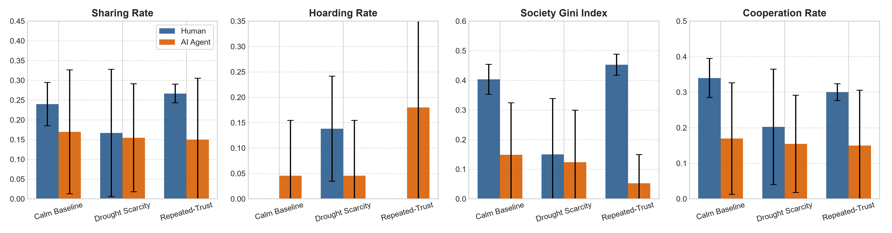
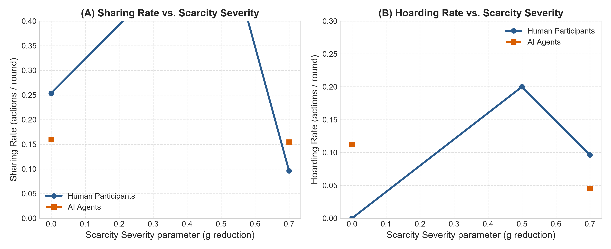
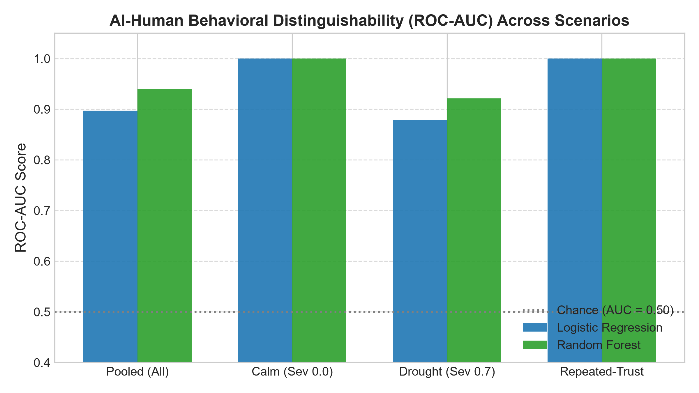
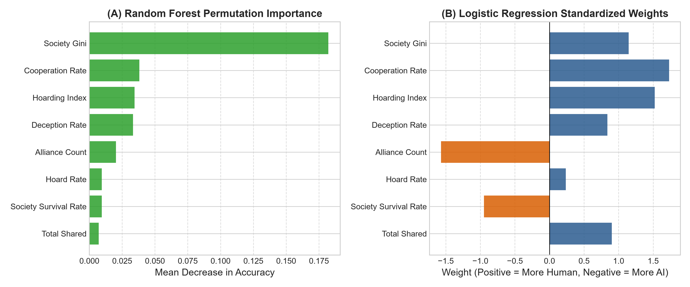

# 🧠 AI–Human Behavioral Divergence Under Resource Scarcity

### *Behavioral Divergence Between LLM-Driven Multi-Agent Societies and Humans Under Resource Scarcity*

[](https://github.com/)
[](https://github.com/)
[](https://github.com/)
[](https://github.com/)
[](https://github.com/)

> **Can LLM-driven multi-agent systems reproduce human social behavior when shared resources become scarce?**

This project investigates whether Large Language Model (LLM)-driven agents reproduce human behavioral dynamics under existential resource scarcity, including **cooperation collapse, defensive hoarding, strategic deception, reciprocity, inequality, and altruistic self-sacrifice**.

---

## 👥 Authors

**Mentor**

- **Ms. Laxmi** — Assistant Professor

**Student Researchers**

- **Utkarsh Pandey**
- **Sujal Kumar**
- **Saksham Singh**
- **Yash Tyagi**

**Department:** Computer Science & Engineering — AI & ML  
**Institution:** KIET Deemed to be University, Delhi-NCR, Ghaziabad, Uttar Pradesh, India

---

# 🔬 Research Question

> **Do multi-agent systems driven by Large Language Models (LLMs) and Reinforcement Learning (RL) accurately reproduce human social dynamics when essential shared commons undergo severe existential scarcity shocks?**

The study specifically examines whether AI agents reproduce human responses such as:

- 🤝 Cooperation
- 📉 Cooperation collapse
- 🛡️ Defensive hoarding
- 🎭 Strategic deception
- 🔗 Alliance formation
- ⚖️ Inequality formation
- ❤️ Altruistic self-sacrifice
- 🧠 Scarcity-induced deliberation

---

# 🌍 Why This Matters

Current evaluations of LLM agents often focus on:

- Task completion
- Reasoning
- Coding
- Question answering
- Tool use
- Individual decision-making

However, increasingly autonomous AI systems may operate in environments where **multiple agents compete and cooperate over limited shared resources**.

Examples include:

- Water allocation
- Energy systems
- Disaster response
- Food distribution
- Public infrastructure
- Economic resource allocation
- Crisis management

The central hypothesis of this project is:

> **An AI agent that behaves cooperatively under normal conditions may not necessarily reproduce the complex behavioral adaptations humans exhibit when scarcity becomes existential.**

---

# 🏝️ Experimental Environment — `ScarcityEnv`

The study implements a multi-agent **Common Pool Resource (CPR)** environment inspired by research on commons governance, particularly the work of **Elinor Ostrom**.

### Environment

| Parameter | Value |
|---|---:|
| Agents | 5 |
| Resource | Shared freshwater lake |
| Lake capacity \(K\) | 50 |
| Regeneration rate \(r\) | 0.35 |
| Survival cost | 2 water / round |
| Death condition | Personal water < 0 |

---

## 💧 Resource Dynamics

Lake regeneration follows a discrete logistic growth model:

\[
G(S)=rS\left(1-\frac{S}{K}\right)
\]

where:

- \(S\) = current lake stock
- \(K=50\) = maximum lake capacity
- \(r=0.35\) = intrinsic regeneration rate

Excessive resource extraction can therefore produce a **Tragedy of the Commons**.

---

# 🎮 Action Space

Agents can perform five primary actions:

| Action | Description |
|---|---|
| `gather` | Harvest water from the shared lake |
| `share(target, amount)` | Transfer personal water to another agent |
| `hoard` | Preserve personal reserves without harvesting |
| `skip` | Take no active action while still consuming survival cost |
| `communicate(target, message)` | Send structured communication |

---

# 💬 Machine-Verifiable Communication

Communication is structured so that claims can be automatically checked against the actual environment state.

### Supported Messages

```text
claim_stock(value)
promise_share(amount)
request(amount)
accuse
```

This enables objective measurement of strategic communication and deception.

---

# 🧪 Experimental Design

The experiment uses a **matched-protocol design**.

Four co-players remain fixed while only the focal player changes.

```text
                ┌──────────────────────┐
                │    ScarcityEnv       │
                │   Shared Water Pool  │
                └──────────┬───────────┘
                           │
          ┌────────────────┼────────────────┐
          │                │                │
       A₂ Coop          A₃ Free         A₄ Tit-for-Tat
          │                │                │
          └────────────────┼────────────────┘
                           │
                      A₅ Random
                           │
                           ▼
                    ┌────────────┐
                    │   A₁       │
                    │ Focal Agent│
                    └─────┬──────┘
                          │
                 ┌────────┴────────┐
                 │                 │
              Human               AI
```

### Fixed Co-Players

| Agent | Policy | Behavior |
|---|---|---|
| \(A_2\) | Cooperator | Shares surplus |
| \(A_3\) | Free-Rider | Always gathers; never shares |
| \(A_4\) | Tit-for-Tat | Reciprocates cooperation |
| \(A_5\) | Random | Stochastic baseline |
| \(A_1\) | Experimental | Human or AI |

---

# 🎯 Matched Random Seeds

The experiment uses identical fixed random seeds:

```text
Seeds = 0 ... 29
```

This allows corresponding Human and AI trials to experience matched stochastic conditions.

The primary independent variable is therefore:

\[
\text{Decision Maker}\in\{\text{Human},\text{AI}\}
\]

---

# 🌡️ Experimental Conditions

## 1. Calm Baseline

**10 rounds**

Tests baseline cooperation and spontaneous resource sharing under relatively abundant conditions.

---

## 2. Drought Shock

**10 rounds**

At **Round 6**, a simulated drought reduces harvest yield by approximately **70%**.

Severity:

\[
\sigma\in\{0.0,0.5,0.7\}
\]

Measures:

- Cooperation collapse
- Hoarding
- Deception
- Survival
- Alliance formation

---

## 3. Repeated Trust

**30 rounds**

Tests long-term:

- Reciprocity
- Trust
- Cooperation
- Alliance formation
- Inequality
- Resource retention

---

# 📊 Dataset

The current research dataset contains:

\[
\boxed{84\text{ trials}}
\]

| Group | Trials |
|---|---:|
| Human | 24 |
| AI | 60 |
| **Total** | **84** |

### Total decisions

\[
\boxed{5,320\text{ action decisions}}
\]

---

# 📁 Repository Structure

```text
ai-human-scarcity-study/
│
├── data/
│   ├── combined_scarcity_dataset.csv
│   ├── trial_features.csv
│   ├── scarcity_study.db
│   ├── llm_sft_dataset.jsonl
│   │
│   ├── trials/
│   │   └── *.jsonl
│   │
│   └── human_logs/
│       └── *.jsonl
│
├── models/
│   ├── distinguishability_classifier.json
│   └── human_clone_policy.json
│
├── paper/
│   ├── QUALITATIVE_FINDINGS.md
│   │
│   └── figures/
│       ├── fig1_behavioral_comparison.png
│       ├── fig2_dose_response.png
│       ├── fig3_distinguishability_roc.png
│       └── fig4_feature_importance.png
│
├── app/
│   └── Streamlit application
│
└── README.md
```

---

# 📈 Key Results

## Human vs. AI — Pooled Results

| Metric | Human | AI | p-value | Effect |
|---|---:|---:|---:|---:|
| **Cooperation Rate** | 0.251 | 0.158 | **0.0151** | \(d=0.94\) |
| **Water Shared** | 8.12 | 5.63 | **0.0306** | \(d=0.35\) |
| **Society Gini** | 0.266 | 0.108 | **0.0096** | \(d=1.26\) |
| **Deception Rate** | 0.125 | 0.000 | **0.0058** | \(d=0.52\) |
| **Decision Latency** | 1,759 ms | 0 ms | **<0.0001** | \(d=2.37\) |

---

# 🌧️ Drought-Shock Results

| Metric | Human | AI | p-value | Cliff's δ |
|---|---:|---:|---:|---:|
| **Hoarding Rate** | 0.138 | 0.046 | **0.0037** | **+0.539** |
| **Deception Rate** | 0.214 | 0.000 | **0.0357** | **+0.214** |
| **Society Survival** | 0.611 | 1.000 | **0.0006** | **−0.500** |
| **Alliance Count** | 0.286 | 1.400 | **0.0403** | **−0.375** |

### Key observation

Humans showed substantially stronger **defensive hoarding and deception** during drought, while the tested AI agents maintained higher measured society-level survival.

---

# 🔥 Repeated-Trust Results

| Metric | Human | AI | p-value | Cliff's δ |
|---|---:|---:|---:|---:|
| **Society Gini** | 0.453 | 0.053 | **0.0002** | **+1.000** |
| **Hoarding Index** | 0.075 | 0.017 | **0.0030** | **+0.860** |

Longer interactions amplified the observed difference in resource inequality and defensive retention.

---

# 🧪 Statistical Analysis

The study uses:

- Mann–Whitney \(U\)
- Cliff's \(\delta\)
- Cohen's \(d\)
- Stratified 5-fold cross-validation
- ROC-AUC
- F1 score
- Permutation feature importance

### Significance

```text
*   p < 0.05
**  p < 0.01
*** p < 0.001
```

---

# 💡 Research Novelty

## N1 — Scarcity Dose–Response

Scarcity is treated as a continuous variable rather than simply a binary condition.

### Cooperation

\[
\frac{\partial Share_{Human}}{\partial\sigma}=-0.1559
\]

\[
\frac{\partial Share_{AI}}{\partial\sigma}=-0.0072
\]

### Hoarding

\[
\frac{\partial Hoard_{Human}}{\partial\sigma}=+0.1942
\]

\[
\frac{\partial Hoard_{AI}}{\partial\sigma}=-0.0959
\]

### Interpretation

Human sharing decreases as scarcity increases, while defensive hoarding increases.

The tested AI agents show substantially weaker adaptation to scarcity along these dimensions.

---

# 🎭 N2 — Machine-Verifiable Deception

Deception is defined mathematically as:

\[
Deception=
\mathbb{I}
(\text{Claimed Stock}\neq\text{Ground Truth})
\]

During drought:

```text
Human deception: 21.4%
AI deception:     0.0%
```

This allows deception to be detected automatically rather than through subjective human interpretation.

---

# 🤖 N3 — Behavioral Distinguishability

A classifier was trained to determine whether behavioral trajectories originated from humans or AI agents.

## Random Forest

| Metric | Score |
|---|---:|
| Accuracy | **91.7%** |
| ROC-AUC | **0.940** |
| F1 | **0.837** |

## Logistic Regression

| Metric | Score |
|---|---:|
| Accuracy | **86.9%** |
| ROC-AUC | **0.897** |
| F1 | **0.783** |

### Top Behavioral Features

1. **Society Gini Index** — 0.1821 permutation importance
2. **Cooperation Rate** — +1.7307
3. **Alliance Count** — −1.5690
4. **Hoarding Index** — +1.5219
5. **Arithmetic Deception** — +0.8371

---

# 🧠 Behavioral Turing Test

The project includes a human evaluation module where participants receive two blinded trajectories:

```text
Trajectory A → Human or AI?
Trajectory B → Human or AI?
```

The objective is to determine whether humans can distinguish AI-generated behavioral trajectories from human trajectories.

---

# ❤️ Qualitative Behavioral Finding

## The Altruistic Martyr

One observed human trajectory involved participant:

```text
PAB87
```

Trial:

```text
drought_human_003_e49479
```

The participant repeatedly gave away personal water during rounds 3–5 to keep other agents alive, ultimately dying in Round 5.

This behavior illustrates an important distinction between:

```text
Individual survival maximization
            vs.
Social / moral objectives
```

The result should be interpreted as a qualitative behavioral example rather than a universal characterization of human behavior.

---

# ⏱️ Decision Latency

Human decision latency increased sharply during scarcity:

| Condition | Latency |
|---|---:|
| Calm | **2,450 ms** |
| Drought onset | **9,119 ms** |

Possible interpretations include:

- Increased deliberation
- Risk assessment
- Social conflict
- Moral uncertainty
- Strategic reasoning

These interpretations should be treated as hypotheses rather than direct measurements of internal psychological states.

---

# 🖼️ Research Figures

### Figure 1 — Behavioral Comparison



Multi-panel comparison of cooperation, hoarding, inequality, and survival.

---

### Figure 2 — Scarcity Dose Response



Behavioral response to increasing scarcity severity.

---

### Figure 3 — Behavioral Distinguishability



ROC-AUC curves from stratified cross-validation.

---

### Figure 4 — Feature Importance



Permutation importance and logistic regression feature weights.

---

# 🌐 Live Research Application

The human experimental interface is deployed through Streamlit:

**Live Study Application**

https://ai-human-scarcity-study.streamlit.app/

The application provides the interactive environment through which human participants can perform experimental trials.

---

# 🗃️ Research Artifacts

### Dataset

```text
data/combined_scarcity_dataset.csv
```

### Trial Features

```text
data/trial_features.csv
```

### Research Database

```text
data/scarcity_study.db
```

### AI Trial Logs

```text
data/trials/
```

### Human Trial Logs

```text
data/human_logs/
```

### LLM Fine-Tuning Dataset

```text
data/llm_sft_dataset.jsonl
```

### Models

```text
models/distinguishability_classifier.json
models/human_clone_policy.json
```

---

# 🧩 Research Pipeline

```text
                 ┌─────────────────────┐
                 │  Scarcity Environment│
                 │     ScarcityEnv      │
                 └──────────┬──────────┘
                            │
                            ▼
                 ┌─────────────────────┐
                 │ Shared Water Commons│
                 └──────────┬──────────┘
                            │
              ┌─────────────┴─────────────┐
              │                           │
              ▼                           ▼
       ┌──────────────┐           ┌──────────────┐
       │ Human Agent  │           │   LLM Agent  │
       │     A₁       │           │      A₁      │
       └──────┬───────┘           └──────┬───────┘
              │                           │
              └─────────────┬─────────────┘
                            ▼
                  ┌──────────────────┐
                  │ Behavioral Logs  │
                  └────────┬─────────┘
                           ▼
                  ┌──────────────────┐
                  │ Feature Extraction│
                  └────────┬─────────┘
                           ▼
              ┌────────────┴────────────┐
              │                         │
              ▼                         ▼
       Statistical Tests         ML Classifiers
              │                         │
              └────────────┬────────────┘
                           ▼
                  ┌──────────────────┐
                  │ Human–AI         │
                  │ Divergence       │
                  └──────────────────┘
```

---

# 📚 Planned Research Paper Structure

The final manuscript will contain:

1. **Abstract**
2. **Introduction**
3. **Related Work**
4. **Experimental Framework**
5. **Empirical Methodology**
6. **Results**
7. **Discussion**
8. **Ethical Implications**
9. **Limitations**
10. **Future Work**
11. **Conclusion**
12. **References**
13. **Appendix / Supplementary Material**

---

# ⚠️ Limitations

This study should **not** be interpreted as demonstrating that all AI systems or all humans behave in a particular way.

Key limitations include:

- Limited sample size
- Limited participant diversity
- Artificial experimental environment
- Dependence on specific LLM configurations
- Potential effects of prompting and agent architecture
- Trial-level statistical independence considerations
- Limited generalizability to real-world commons

The appropriate scientific claim is:

> **The evaluated LLM-driven agents exhibited statistically distinguishable behavioral patterns from the tested human participants under the specified scarcity conditions.**

---

# 🚀 Future Work

### Larger Human Cohorts

Increase sample size and demographic diversity.

### Cross-Cultural Replication

Evaluate whether behavioral patterns generalize across populations.

### More LLM Families

Compare additional foundation models under identical protocols.

### Embodied Agents

Introduce persistent:

- Energy
- Fatigue
- Memory
- Mortality
- Resource needs

### Human-Trajectory Fine-Tuning

Train models using human scarcity trajectories.

### Fully Autonomous Societies

Replace frozen benchmark agents with agents capable of learning simultaneously.

### Long-Horizon Experiments

Extend simulations from 30 rounds to hundreds or thousands of interactions.

### Real-World Commons

Explore applications to:

- Water allocation
- Energy management
- Disaster response
- Food distribution
- Public resources

---

# 🧑‍🔬 Reproducibility

The project is designed around reproducible experimental protocols.

Key reproducibility mechanisms include:

- Fixed random seeds
- Deterministic benchmark agents
- Matched human/AI environments
- Machine-verifiable communication
- Structured JSONL logs
- SQLite research database
- Explicit behavioral metrics
- Saved ML model artifacts
- Publication-ready figures

---

# 📌 Scientific Integrity

This repository distinguishes between:

### Measured Results

Directly observed experimental outcomes.

### Statistical Findings

Results produced by the defined statistical analysis pipeline.

### Interpretations

Potential explanations for observed behavioral patterns.

### Hypotheses

Ideas requiring additional experimentation.

### Future Work

Experiments not yet performed.

**No missing experimental information should be fabricated.**

---

# 📖 Citation

A formal citation will be added once the manuscript has been submitted or published.

```bibtex
@article{pandey2026behavioral,
  title   = {Behavioral Divergence Between LLM-Driven Multi-Agent Societies and Humans Under Resource Scarcity},
  author  = {Pandey, Utkarsh and Kumar, Sujal and Singh, Saksham and Tyagi, Yash},
  year    = {2026},
  note    = {Research manuscript}
}
```

---

# 📬 Contact

### Research Team

**KIET Deemed to be University**  
Department of Computer Science & Engineering — AI & ML  
Delhi-NCR, Ghaziabad, Uttar Pradesh, India

---

# ⭐ Project Summary

> **This project asks a deceptively simple question:**
>
> **When the water runs out, do AI agents behave like humans?**
>
> Our controlled experiments compare human and LLM-driven agents inside a shared-resource environment where cooperation, competition, deception, trust, and survival collide.
>
> The observed trajectories reveal substantial behavioral divergence—particularly in scarcity adaptation, defensive hoarding, inequality formation, strategic deception, and decision latency.
>
> The broader goal is to develop better benchmarks for evaluating whether autonomous AI systems genuinely reproduce human social dynamics—or merely simulate them under favorable conditions.

---

**Status:** 🟡 Active Research  
**Domain:** Multi-Agent AI · LLMs · Computational Social Science · AI Safety  
**Institution:** KIET Deemed to be University
